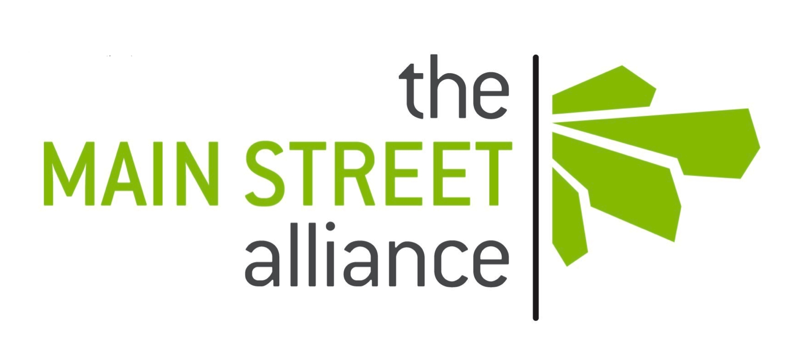

{::options auto_ids="false" /}
{::options parse_block_html="true" /} 

# "We are deeply concerned with the FCC's proposal to roll back its existing strong net neutrality rules."
## Over 500 small businesses have spoken out against new fees, throttling & censorship online.

* [Businesses](#businesses)
* [Sign On](#signon)

<a href="#letter" class="button">Read The Letter</a>

---

## Businesses
{: #businesses }

* 
* 
* 
{: #anchor-businesses }

*2b1 Inc.
*3 Nimbus LLC
*a-ka-neArt
*Absolute Voiceover
*Advanced Surfaces and Processes Inc.
*Agency Nunez, Inc
*Agent 144 Sales
*AirborneSurfer Productions
*Anthony DiRoma's Natural Motion Salon
*Anthonys ArtElectrix
*Apaches From Paris Music
*Arcway Industries, LLC
*Arias machine inc.
*ArrivaDolce
*Astro Zombies
*Athena Mayeux, Graphic Design
*Audio Video Integration
*AugustSings
*Aurora Broadcasting
*Bagel Radio
*Barcelona Sporting Goods
*baum•hauer photo
*Bay Buys, LLC
*BDB Creative
*BDB Enterprises, VLLC
*Bead & Reel
*Beanfields PBC
*Bearded Frida
*BEH Computer Specialties
*Better Speech Now, LLC
*Bitter Jester Studios
*Bitwise Consulting, LLC
*Black Hills Computer Consulting, Inc.
*Blog222/Reg222.net
*BlowFish SEO
*Blue Egg Adventures
*Body by Kelli LLC
*Boortz PR Communications
*Boston Building Resources
*Bothand Consulting, LLC
*Brand Strong Marketing
*Brendshann Construction Co, Inc.
*Bridge Financial Technology Inc.
*Bublitz & Koch Construction
*Burlington Telecom
*Buttontapper Press
*By The Way Labs, LLC
*C. Wolfe Software Engeering
*Cagno Solutions
*Capitol Pacific Reporting
*Caramagno and Associates, Ltd
*Cari Wright HHP
*Carla Edmiston Massage Therapy
*CDN.net
*Celestial Buttons
*Centennial Vapor
*Central Chapel Funeral Home
*Chagrin Valley Soap & Salve
*Chocolate Pocket, LLC
*Circulation Studio
*Civic Hall
*CJBS, LLC
*Clarion Group Live, Inc.
*Clayton Cowles Illustration & Lettering
*Clean air illinois
*Clearview Furniture
*Cloudly
*CoachAccountable, LLC
*Coaching Financial
*Codecademy
*Coherence Collaborative
*Coler Insulation
*Collaborative Design & Planning
*Colonial Life
*Common Source Acupuncture
*Communitas Financial Planning
*Complete Spectrum Financial Services
*Connectify Inc
*Conservation Economics
*Continuum Industries, Inc
*Cooperstown Cheese Company
*Copia Institute
*Copper Note
*Cornelius Consulting Services
*Cox-Mills Ranch
*CPD Solutions
*CPUgrades
*CREATION AUDIO
*Crowd Supply
*Crowmark Creations
*Crush Wine Distributors
*Curiosity IO
*Custom 509 LLC
*Cx Associates, LLC
*D/R Services Unlimited, Inc.
*D&T Onsite Computer & Network consulting
*DAC Audit Services, LLC.
*Damn Interesting
*Daniel R Hamm PC
*Dave Ferguson, Independent Insurance Agent
*David Cowles Illustration
*Day to Day Fresh Frozen Foods, LLC
*DC Action Lab
*DCC, Inc
*Dean Lumber Products
*Del Norte Medical Imaging
*Destiny Speaks
*DetritusGroup
*devorahssong
*Diagnostic Medical Imaging
*DigitalOcean
*Ding-it.net
*Disability is Natural
*Distance Learning Consulting
*DK Support Services LLC
*DL Environmental Services 
*Dobson Computer Services
*DoTerra Wellness Consultant
*DPOE
*Dr. Alison Guzman, MD
*Dr. Lea Morgan, MD
*Dread Central Media LLC
*Dream Cakes, Inc.
*DreamHost
*dsherman.design
*Dwyer & Coogan, P.C.
*E K & Associates
*E. R. West & Associates, Inc.
*Eagleflight Enterprises
*Ecco Bella
*eCnet Solutions
*EcO Design Homes LLC
*EdTech Strategies, LLC
*Eighty2degrees LLC
*Encyclia LLC
*EnderSwift LLC
*Endosys, LLC
*Energy Compression Inc.
*Engineered Fear LLC
*Entertainment Under The Stars, LLC
*Eric A. Wessman, Photographer, LLC
*ESSDACK
*ET Productions
*Ethical Markets Media
*Euphonic Studio LLC
*Evergreen Sustainability, LLC
*EvoText Inc.
*Fabrinique
*Falconia Partners LLC
*FDA Consulting, LLC
*Fiedler on the Roof Construction
*Figure 8 Investment Strategies
*Financial Alternatives
*FINE
*First Search, Inc.
*Fitzpatrick & Associates
*Flat Out Motorsports
*Foxy pet photos
*Frame x Frame Productions
*Fulcrum HR Consulting
*Fuzzco
*Garrin Evan Studios
*GCI Flooring
*Global Capital Funding Group, LLC
*gms tactical
*Gnosis Media Group
*Golan Christie Taglia LLP
*Golden Frog
*Goldman & Ehrlich
*GoodLight Natural Candles
*Gourd & Associates
*Graphik Dimensions
*Great Northern Landholding and Mining Company, Inc.
*Great Scott Technology, LLC
*Hacktron Technology Inc.
*HarborWest Design
*HardPressedRecords
*Harmony Acupuncture, LLC
*Harmony Grows, Infinity Tree Tarot
*Hayes Support
*Healing Connections
*Hearing Wellness Centers
*Heartfocus Counseling
*heaton & company, pc
*Hels Kitchen Catering 
*Hempy's
*HF Ranch
*High Flight Arts and Letters
*Highland Park Chamber of Commerce
*Hladky Real Property, LLC
*Holly Kukkonen's Piano Studio
*HowCreativeSolutions.com
*Humblebee Media 
*Hutch Heating & Cooling Inc.
*iFixit
*Image Architects
*Imgur, Inc. 
*In-telligent LLC
*Incom Technologies
*InfoprosNetwork
*Inner Illumination
*Inner Renewal and the Healthy Path
*Innovative Awareness LLC
*Instant Ocean
*Inter-Hemisphere Tours
*Investors Team Realty Inc.
*Iris b. Branding & communications
*Irving House Corporation
*Item Crafting
*ITEX in Chicagoland
*itpwebdesign
*Ivan Edits
*Iyengar Yoga Center of Grand Rapids
*J Krug & Associates
*J.F.S. Production Co., Inc.
*Jan Niemira Psychotherapy
*Jane Thomas Press
*Janell McCanna Design
*JB Wood Group LLC
*JerrixIT
*jewelry by NaLa
*JL Gray Company
*John F. Kindergan, Inc.
*John Fister Music
*Joseph Loduca, DDS - General Dentistry
*Juggin Visuals
*JuniorExplorerClub
*Just Consider It Done
*Just Goods
*Just in Time Direction
*K Tech LLC
*Kaizen Conlsulting
*Kappel & Apple
*Karen Bevels Custom Catering & Events
*Karen Peterson Design
*Keep It Simple Books
*Kenneth A.. Henry, Attorney at Law
*Keyrenter Property Management Chicago North
*KJM Consultancy
*L.W. Griffins Supply LLC
*Langelan & Associates
*Lanis Fabric Arts
*Laseronix Lasers
*Laura Roberts Creative Services
*Laurel Digital, LLC
*Law Office of Marc N. Blumenthal
*Law Offices of Frank J Prochilo
*Law Offices of Richard A.Crane
*LDW Group
*Leadership & Strategy for Sustainable Systems
*Lee Ranch
*Lett Direct, Inc.
*Lifestyler Music
*Light and Sound Media LLC
*Light Sound Dimension
*Liquid Mastering
*Littleplow LLC
*LJ Hughes Associates
*Logos World Inc
*Long Pond Cabins
*LTCI Partners, LLC
*Luola
*Lynch Music, Inc
*Madrona Motor Court
*Main Royal Design
*ManageYourLaserPrinters.com
*Marazul Publishing
*Marcacci Labs, Inc
*Marcia McKinzie Art
*Marin Sunshine Realty
*Mark T. O'Brien, D. O.,P.C.
*Mark Wyner LLC
*Marks & Klein
*Marlene Puaoi, CSR
*Massage Planet RMT
*Matthew Meier Photography
*Mays Civic Innovation, LLC
*McGovern & Greene LLP
*McLeodGaming Inc.
*MCM Inventions, Inc.
*MDE Communications
*MDI Imported Car Service, Inc.
*MediaIgniter
*Merchant Services Group LLC
*MetalSucks.net
*Metamuse Media
*Miami Solutions
*Michaels Conusulting, Ltd.
*Michigan Healthy Living and Sustainability, Inc.
*Midwest Young Artists Conservatory
*Mirador Kitchen & Home
*Misk.com
*Mission Communications
*Mixtape Comics
*mobilia, inc.
*Modern Trade Productions, LLC
*MOH Design, LLC
*Moosewood Restaurant
*Moraine Valley Chiropractic Center
*Moss Veterinary Referrals, PLLC
*MousePaw Media
*Move Ahead
*Move Beyond Limits
*Mow Town Country Services
*Multilingual Connections
*Mysterious Galaxy
*Needleman Property Management
*Net Informant, Inc.
*Netcetera, Inc.
*New Day Network Wellness Center
*New Games Ltd.
*New Sky Strategies, Inc.
*Nextdoor
*Nikki Sachs, LCSW
*NodeCraft Hosting LLC
*nogosauces.com.au
*NorTech
*North Coast Radiology
*NY Tech Alliance
*O'BRIEN Family Realty
*Oaktown Jerk
*Ocean Motion Media, LLC
*OHG Networks LLC
*Ohrvall Media LLC
*Olio City, Inc.
*One Handed VIP, LLC
*One Inch Heroes
*Only Connect...Publications
*Opal Capital, Inc
*Originate Natural Building Materials
*Otherwild
*Owens Business & Consulting, LLC
*P1WS
*Paladin Contemporaries
*Panelist Media
*Pearce Construction Company
*Perry Harris Plumbing and Heating
*Personal Beast Inc.
*Pete Miller's Water and Wildlife Studio
*Photobot 3000
*Physical Therapy Advantage
*Pipe Organs/Golden Ponds Farm
*Plain City Druggist
*Planet K
*PMP inc
*Point of View Productions
*Pony Named Bill Tack Shop
*Poster It
*Premier Computer Consulting, LLC.
*Prism Corporation
*Private Internet Access
*Pro PDR, llc
*Pucks and Recreation
*QuipTracks LLC
*R We Still On Time? 
*Radix Media
*RARE Garments
*Ravinia Plumbing and Heating, Inc.
*Read Andra Watkins LLC
*RecycleMatch
*Renaissance Miniatures
*Rentorations Limited
*Research Associates
*Rhino Digital
*Ridgeline Wealth Advisors
*Ringspann Corp.
*Ritz Sales & Service
*Roaring Tiger
*Robb Reece Photography
*Ross Cottage
*Rowan Everard LLC
*Rune's Furniture Co.
*S. Keith Collins, Attorney at Law
*sabao
*Sacred Flows
*Sacred Portals Art
*San Juan Update
*sanctuary hill farms
*Sandkamp Woodworks LLC
*Sarah B Stewart, Psy.D., PLLC
*Schulte Group
*ScientiaCME, LLC
*Scott Law Firm
*SCT Alternative Inc.
*Second Opinion Solutions
*Senior Transitions Concierge
*Share The Wealth Productions
*Sharpr
*Sheridan Road Financial
*Sherrie Marchi Coaching Ind
*Shifting Patterns Consulting
*Sierra Unix Consulting LLC
*Silver Lining Unlimited
*Simply Made Apps
*Simply Stated Architecture, PC
*SingerSCPM.com
*Single, LLC
*Singlebrook
*SingleHop
*SkySpecs
*SLPPOA
*Small Business Advocacy Council
*SMB Logic
*Smith, Rolfes & Skavdahl Company, L.P.A.
*Snowbound Books
*Snyder Electronics
*Soap Alchemy LLC
*SoloProWebs
*Sounding Stone
*Space Inch
*Spark PC
*Spike Maiden Mueller, Composer/Arranger
*Spirit Filled Press
*Spiritbody Inc
*Spirituality & Practice
*Sponge Studio
*spring gulch farm
*Staach
*Starbelly Studios Inc
*Starvault LLC
*Steadfast
*StreamText.Net, Inc.
*Sue Kauffman Fitness
*Sunflower
*Sunridge LLC
*Super Grow Lasers
*Superluminal Systems
*Susquehanna Glass Co.
*Sustainable Hosting
*Sustana
*Suzanne Cerny Fine Art, Illustration, Digital Art
*Sympatico Clothing
*Taos Green Chamber of Commerce
*Tarheelstate Teacher LLC
*Team Merchant
*Tel-Affinity Corp.
*Texas Beard Company
*The Confection Connection
*The Dini Group, Ltd
*The Farthest Pixel
*The Gift Street Ltd.
*The Hollow Oak
*The Jewelry Vault
*The Law Offices of Tom Olofsson, LLC
*The Movitz Group
*The Patrick Group Inc
*The Public Society
*The Regulator Online
*The Silk Route Antiques
*The Sound Guy, Inc.
*The Stationery Station. Ltd
*The Thrifty Wildflower
*The Wilderness Inn, LLC
*The WinterBadger Collection
*Therapeutic Kneads, Ltd.
*they&them
*Thinkshift Communications
*Third Coast Complexity
*Thirdarm Promotions
*Three Treasures Acupuncture
*Thunder Puppy Art
*Thuzio 
*Tierra de Mar Music
*Timber Ridge Construction
*Ting 
*Tiny Design Studio
*Trade Inflo
*Transition Services, Inc.
*TRC Tech
*Trees Cut Stars Design Studio
*TriLibrium
*Triple Ethos, LLC
*True North Creative Learning Center
*True Self Coaching, LLC
*Tye Newton Design
*Underflow Studios
*United Business Association of Midway
*Unlimited Diamond Works, LLC
*Unlimited Media
*Urban Iguana Productions
*Ventamatic LTD
*Venture Boxes, LLC
*Vidme
*Vintage Connections
*Virginia Kondziolka, Graphic Design
*vmrproducts llc
*VoidTracks
*WakaTime
*Wallin Mental Medical
*Wanderu Inc
*WebConference.com
*Well Spent
*WellBeing: Therapeutic Massage
*Westy92 LLC
*What A Great Website
*Whatsits Galore
*Whole Health
*Wilke Systems International, Inc
*World Business Academy
*WritAnon
*WTKoch GCP QA Consulting, LLC
*www.shandormusic.com
*www.tincan.social
*X-Lab
*Xyzzy Kosmic Canonical Distribution LLC
*Yankee Bookshop
*Z-Marketing
*Zocalo Productions

See over 500 more

---

## Sign the Letter
{: #letter }

### Add Your Company's Name Below

{: #signon}

{::options parse_block_html="false" /}

	Submitting form... 
	

<form method="post" action="https://queue.fightforthefuture.org/action" accept-charset="UTF-8">
	

	

		<input id='full_name' type="text" name="member[first_name]" placeholder="Name *" title="Full Name" autocomplete="name" required>
	

	

		<input id='company' type="text" name="member[company]" placeholder="Company Name *" title="Company name" required>
	

	

		<input id='email' type="email" name="member[email]" placeholder="Email *" title="Email" required>
	

	

		<input id="postcode" type="text" name="member[postcode]" placeholder="Zip Code *" title="Postcode" required>
		
This information is helpful for alerting members of Congress.

	

	

		<input id="phone" type="tel" name="member[phone_number]" placeholder="Phone Number" title="Phone">
		
Adding your number is optional, but will allow us to get in contact if there are any campaign developments we think you should be aware of.

	

    

        <textarea name="action_comment" title="Comments (optional)" placeholder="Comments (optional)"></textarea>
		
Tell decision-makers why net neutrality matters to your business.

    

	

		<button class="button">Sign On</button>
	

    

      
Fight for the Future will contact you about future campaigns. <a href="https://www.fightforthefuture.org/privacy/">Privacy Policy</a>

    

	<input type="hidden" name="subject" value="Protect Net Neutrality!"/>

	<!-- Mothership Honeypot Bot Defense -->
	<input class="hide" type="checkbox" checked="checked" name="hp_enabled" />
	<input class="hide" type="checkbox" name="hp_disabled" />
	<input class="hide" type="text" name="guard" value="" />

	<!-- Action Network -->
	<input type="hidden" name="an_tags" value="[&quot;net-neutrality&quot;]"/>
	<input type="hidden" name="an_petition_id" value="d21e1b6f-cdc8-49b2-bdf0-fb96b7a39879"/>
	<input id="source" type="hidden" name="subscription[source]" value=""/>
</form>

{::options parse_block_html="true" /}

## Read the Letter
<strong><a href="https://www.keepthewebopenforbusiness.com/FCC_17-108_smallbusiness-ASBC-filing-170830.pdf">Download the PDF</a> 
	
</strong>

> Dear FCC Chairman Ajit Pai and Members of Congress,
>  
> We are a group of businesses empowered by unencumbered
access to an open Internet.  We are deeply concerned with the Federal
Communications Commission’s proposal to roll back its existing strong net
neutrality rules based on Title II of the Communications Act. We urge you to
maintain the existing rules instead.
>  
> Today, broadband is vital to American enterprise; connectivity is absolutely
essential to businesses. We also depend on a strong competitive framework and
legal foundation to ensure that Internet service providers (ISPs) cannot
discriminate against websites, services, and apps, or impose new fees that harm
small businesses.
>  
> The open Internet has made it possible for us to rely on a free market where
each of us has the chance to bring our best business ideas to the world without
interference or seeking permission from any gatekeeper first. This is possible
because the principle of net neutrality ensures that everyone has unimpeded
access to the Internet.
> 
> The Commission’s long-standing commitment and actions undertaken to protect the
open Internet are a central reason why the Internet remains an engine of
entrepreneurship and economic growth. We are deeply concerned that the proposed
regulatory changes to net neutrality will undermine free markets and
competition on the Internet. Despite assurances to the contrary, the changes
proposed by the FCC would remove the only existing legal foundation strong
enough to ensure net neutrality protections are enforceable: Title II of the
Communications Act, as implemented in the agency’s 2015 Open Internet Order.
> 
> While only a small handful of companies sell Internet access, nearly every
company in the country buys it – including ours. Weakening or rolling back the
2015 protections would be disastrous for the country’s business community.
> 
> Internet providers would gain new powers to steer businesses and customers one
way or another. For example, our customers’ Internet access providers could
charge us new fees for the right to get to our customers, or for prioritized
access to our customers. While big companies might be able to afford a
pay-to-play prioritized ‘fast lane’ to users, small and medium sized
enterprises like ours cannot; at the very least, such new fees would put us at
a distinct disadvantage with larger competitors. Internet access providers
could also charge our customers new fees for access to our websites and
services. And they could favor our competitors by slowing down our traffic or
exempting our competitors’ traffic from users’ data caps, or they could block
websites and apps outright. This would create immense uncertainty for companies
in every sector of the economy who rely on open, unencumbered connectivity as a
key enabler for their business and productivity.
> 
> While countries around the world embrace strong, common sense net neutrality
protections, American businesses could be left behind. We urge you to maintain
strong net neutrality rules and focus on policies that lower the barriers to
the deployment of new networks, encouraging more competition in Internet access
services.
> 
> Thank you for considering our views.

[Sign the letter](#letter){: .button}

---

## Press Coverage

* Boing Boing: [As mobile carriers ramp up bribery program, Internet coalition says no to "zero rating"](http://boingboing.net/2016/05/24/as-mobile-carriers-ramp-up-bri.html)
* Broadcasting & Cable: [FCC Asked to Open Formal Proceeding on Zero Rating Plans](http://www.broadcastingcable.com/news/washington/fcc-asked-open-formal-proceeding-zero-rating-plans/156767)
* Consumerist: [Reddit, Yelp, Kickstarter, 55 Other Internet Businesses And Activists Ask FCC To Investigate Zero-Rating](https://consumerist.com/2016/05/25/reddit-yelp-kickstarter-55-other-internet-businesses-and-activists-ask-fcc-to-investigate-zero-rating/)
* DSL Reports: [Reddit, Mozilla Urge FCC to Act on Zero Rating, Usage Caps](http://www.dslreports.com/shownews/Reddit-Mozilla-Urge-FCC-to-Act-on-Zero-Rating-Usage-Caps-137040)
* Engadget: [Tech alliance asks the FCC to investigate data cap exceptions](http://www.engadget.com/2016/05/25/companies-ask-fcc-to-investigate-data-caps/)
* Gizmodo: [The Next Battle for Net Neutrality Is Getting Bloody](http://gizmodo.com/the-next-battle-for-net-neutrality-is-getting-bloody-1778648849)
* The Hill: [Tech groups want public probe of zero-rating plans](http://thehill.com/policy/technology/281020-tech-groups-want-public-probe-of-zero-rating-plans)
* MediaPost: [Silicon Valley Protests 'Zero-Rating' Schemes, Calls For New FCC Rules](http://www.mediapost.com/publications/article/276601/silicon-valley-protests-zero-rating-schemes-cal.html)
* Motherboard: [Medium, Mozilla, and Kickstarter Signed a Letter Against Zero-Rating](http://motherboard.vice.com/read/medium-mozilla-and-kickstarter-signed-a-letter-against-zero-rating)
* Phone Arena: [Open-internet advocates ask FCC for public evaluation of carrier zero-rated data](http://www.phonearena.com/news/Open-internet-advocates-ask-FCC-for-public-evaluation-of-carrier-zero-rated-data_id81503)
* Politico Morning Tech: [Tech companies, activists want zero-rating transparency](http://www.politico.com/tipsheets/morning-tech/2016/05/morning-tech-facebook-tweaking-trending-topics-tech-companies-activists-want-zero-rating-transparency-senate-commerce-weighs-internet-oversight-plans-214456)
* Techdirt: [Reddit, Mozilla, Others Urge FCC To Formally Investigate Broadband Usage Caps And Zero Rating](https://www.techdirt.com/blog/netneutrality/articles/20160524/09450534536/reddit-mozilla-others-urge-fcc-to-formally-investigate-broadband-usage-caps-zero-rating.shtml)
* TomsHardware: [Mozilla, Reddit, Vimeo, And Others Call On FCC To Publicize Its Zero-Rating Plans](http://www.tomshardware.com/news/companies-call-fcc-zero-rating-plans,31877.html)
* The Verge: [Reddit and other web companies ask FCC to reexamine free data programs](http://www.theverge.com/2016/5/25/11773432/reddit-fcc-net-neutrality-letter-kickstarter-etsy-mozilla)

---

Hosted by:

Press Contact: [press@fightforthefuture.org](mailto:press@fightforthefuture.org) / [+1 508 474 5248](tel://15084745248)

